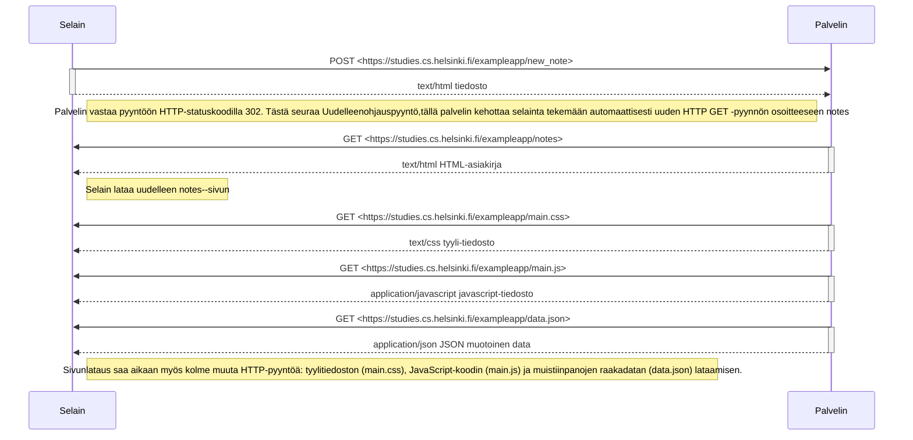

```mermaid
sequenceDiagram
    participant Selain
    participant Palvelin
Selain->>Palvelin: POST <https://studies.cs.helsinki.fi/exampleapp/new_note>
activate Selain
Selain -->> Palvelin:  text/html tiedosto
deactivate Selain
note left of Palvelin: Palvelin vastaa pyyntöön HTTP-statuskoodilla 302. Tästä seuraa Uudelleenohjauspyyntö,tällä palvelin kehottaa selainta tekemään automaattisesti uuden HTTP GET ‑pyynnön osoitteeseen notes
Palvelin ->>Selain: GET <https://studies.cs.helsinki.fi/exampleapp/notes>
activate Palvelin
Palvelin -->>Selain:  text/html HTML-asiakirja
deactivate Palvelin
note right of Selain: Selain lataa uudelleen notes--sivun
Palvelin ->> Selain: GET <https://studies.cs.helsinki.fi/exampleapp/main.css>
activate Palvelin
Palvelin -->> Selain: text/css tyyli-tiedosto
deactivate Palvelin
Palvelin ->> Selain: GET <https://studies.cs.helsinki.fi/exampleapp/main.js>
activate Palvelin
Palvelin -->> Selain: application/javascript javascript-tiedosto
deactivate Palvelin
Palvelin ->> Selain: GET <https://studies.cs.helsinki.fi/exampleapp/data.json>
activate Palvelin
Palvelin -->> Selain: application/json JSON muotoinen data
deactivate Palvelin
note right of Selain: Sivunlataus saa aikaan myös kolme muuta HTTP-pyyntöä: tyylitiedoston (main.css), JavaScript-koodin (main.js) ja muistiinpanojen raakadatan (data.json) lataamisen.
```
