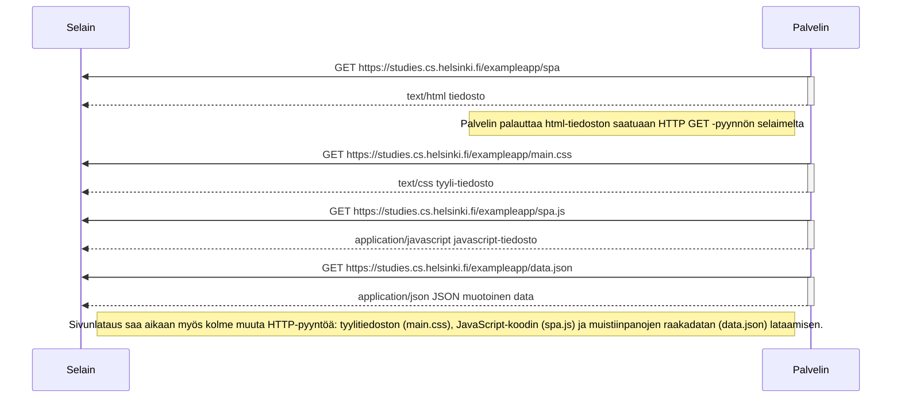

```mermaid
sequenceDiagram
    participant Selain
    participant Palvelin
Palvelin ->> Selain: GET https://studies.cs.helsinki.fi/exampleapp/spa
activate Palvelin
Palvelin -->> Selain: text/html tiedosto
deactivate Palvelin
note left of Palvelin: Palvelin palauttaa html-tiedoston saatuaan  HTTP GET ‑pyynnön selaimelta
Palvelin ->> Selain: GET https://studies.cs.helsinki.fi/exampleapp/main.css
activate Palvelin
Palvelin -->> Selain: text/css tyyli-tiedosto
deactivate Palvelin
Palvelin ->> Selain: GET https://studies.cs.helsinki.fi/exampleapp/spa.js
activate Palvelin
Palvelin -->> Selain: application/javascript javascript-tiedosto
deactivate Palvelin
Palvelin ->> Selain: GET https://studies.cs.helsinki.fi/exampleapp/data.json
activate Palvelin
Palvelin -->> Selain: application/json JSON muotoinen data
deactivate Palvelin
note right of Selain: Sivunlataus saa aikaan myös kolme muuta HTTP-pyyntöä: tyylitiedoston (main.css), JavaScript-koodin (spa.js) ja muistiinpanojen raakadatan (data.json) lataamisen.
```
