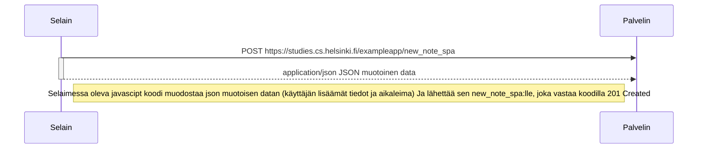

```mermaid
sequenceDiagram
    participant Selain
    participant Palvelin
Selain->>Palvelin: POST https://studies.cs.helsinki.fi/exampleapp/new_note_spa
activate Selain
Selain-->>Palvelin: application/json JSON muotoinen data
deactivate Selain
note right of Selain: Selaimessa oleva javascipt koodi muodostaa json muotoisen datan (käyttäjän lisäämät tiedot ja aikaleima) Ja lähettää sen new_note_spa:lle, joka vastaa koodilla 201 Created
```
